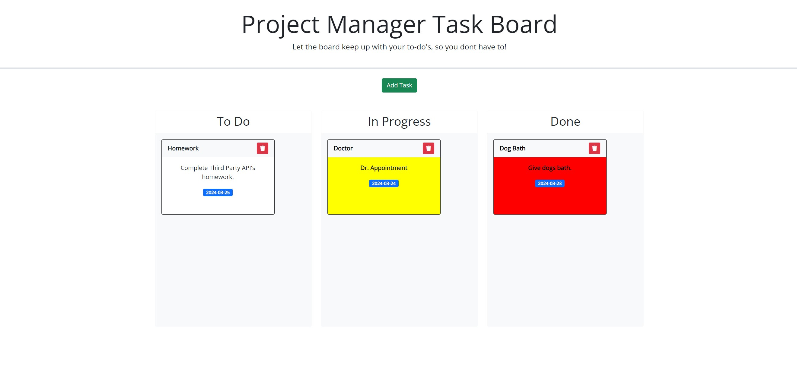

# Luis's Project Task Manager Board (Module 05 Third Party APIs Challenge ) 

## This Challenge contains my personal Task Manager Board to include the following functions:
- Allows for wesbite visitor to enter a task title, due date, and task description.
- Once you hit the add task button, the website visitors will be added to the To-do List lane.
- The user will be free to move tasks to the in prgress lane and done lane as they complete their listed tasks.
- The information entered is saved locally to the storage.

## Installation
- To access my personal blog website follow link: https://ricanlonghorn23.github.io/Project-Task-Manager-Board/
- To Access my personal blog website repository: https://github.com/ricanlonghorn23/Project-Task-Manager-Board.git

## Usage
The user will need to enter the URL https://ricanlonghorn23.github.io/Project-Task-Manager-Board/. When they enter, they will be on the landing page of the personal task manager board. The user will be given a chance to add a task and then enter their task title, due date, and task description. Once they have clicked add task the tasks will be added to the To-Do lane. Once the tasks are added to the To-do lane, the user will be able to drag and drop their task into the In-progress lane and done lane as they complete their listed task. Each task box also has the option to delete the task box at any time. Additionally, each task box based on the due date will change colors. For example, the box will turn red if the due date is past due. If the task date is on the exact due date, the box will turn yellow.

 

## Credits
Luis Aldaz

